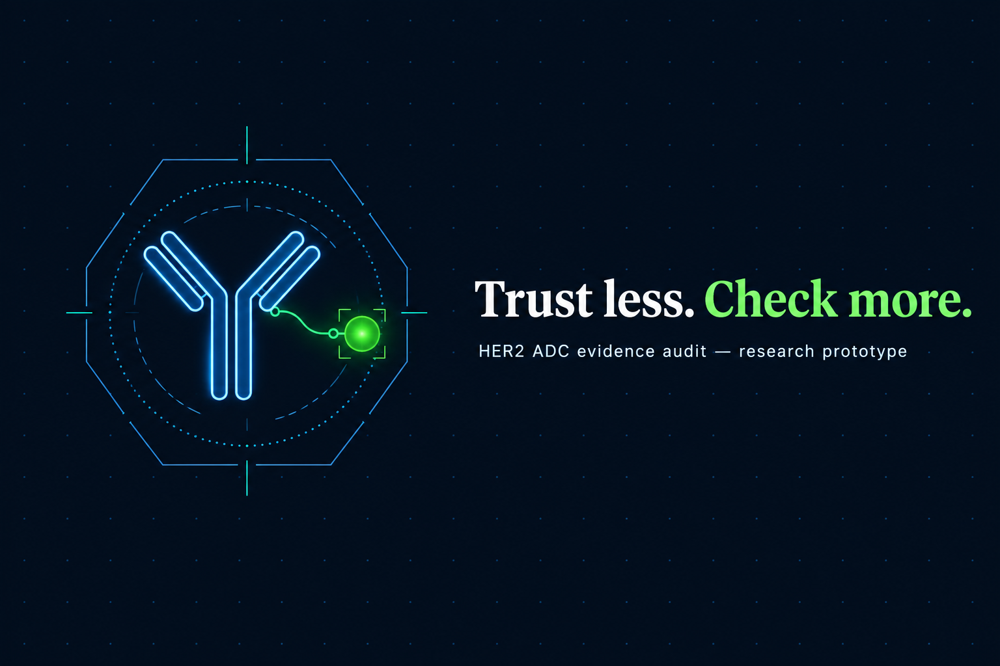
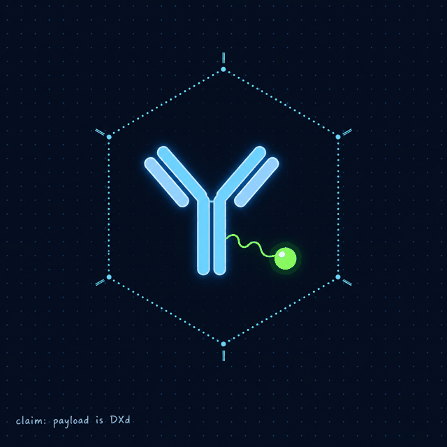

# AntiConjugate — adc-guardrail & Conjugate

<p align="center">
  
</p>

<p align="center">
  
  
  
  <a href="https://huggingface.co/spaces/Ryukijano/conjugate"></a>
</p>

<p align="center">
  <b>Live demo:</b>
  <a href="https://huggingface.co/spaces/Ryukijano/conjugate">huggingface.co/spaces/Ryukijano/conjugate</a>
  ·
  <a href="https://ryukijano-conjugate.hf.space">ryukijano-conjugate.hf.space</a>
</p>

> **Trust less. Check more.** Research agents fail in ways that read well: they invent ADCs, cite trials
> that were never registered, and accept false premises hidden in the question. This repo is two
> experiments in making those failures visible — a Python prescribing-risk agent with a blocking
> guardrail, and a TypeScript claim-audit app where code, not the model, writes every verdict.

> Decision support for a qualified prescriber only. All clinical content is a draft until the team
> pharmacist signs it off. No real patient data — synthetic inputs only.

## Demo

<p align="center">
  
</p>

Open the Space and press `PageDown` — the front page is a nine-section written presentation
(3-minute pitch, zero waiting): why medicines are hard for AI, what the agent may touch, how the
harness works, two recorded failure demos, a live benchmark table, a failure-modes gallery and
honest limits. Talk track: [`conjugate/docs/PRESENTATION.md`](conjugate/docs/PRESENTATION.md).

## The two projects

### 1. `adcg/` — adc-guardrail (Python)

Given an ADC and a synthetic elderly patient, the agent returns a short **prescribing-risk card**
with flags, evidence that resolves against our own data, and an explicit "I don't know". A separate
guardrail estimator blocks risky cards for pharmacist review. We compare it to a plain LLM on a
clinician-written mini benchmark.

### 2. `conjugate/` — Conjugate (TypeScript monorepo)

A claim-audit app for HER2 antibody-drug conjugates. Claude (`claude-opus-5-5`, optional) plans and
drafts citation ids only; a deterministic verifier decides *supported / contradicted / not enough
evidence*. A premise gate stops invented products and unverifiable references **before any model
call**, and live answers come back with hashed receipts from five allowlisted sources
(ClinicalTrials.gov, PubMed, openFDA, DailyMed, ADCdb).

| Path | What |
|---|---|
| `adcg/agent.py` | Python agent: table lookup → rules → LLM drafting → citation validation → abstain → counterfactual check |
| `adcg/guardrail.py` | neutral estimator of P(card misses a must-flag); blocks above a clinician-set threshold |
| `adcg/rules.py` | deterministic organ-function / interaction / payload-class checks |
| `adcg/baseline.py` | plain LLM baseline with the same output schema |
| `adcg/score.py` | reward, Brier, abstention, missed must-flags, fake citations, guardrail stats |
| `benchmark/test/items_public.json` | 30-item team benchmark, **inputs only** — gold kept outside the repo by the test owner |
| `knowledge/` | payload-class toxicity/check tables (**UNVERIFIED**, pharmacist to review) |
| `data/` | curated label / SOP / expression / ADCdb records fed to the agent (**UNVERIFIED**) |
| `conjugate/apps/api` | Fastify API: chat, research turns, live retrieval with receipts, workbook snapshot (31 ADCs) |
| `conjugate/apps/web` | React/Vite UI: presentation front page, research chat, claim check, Evals, Linker lab |
| `conjugate/packages/shared` | Zod contracts shared by client, server and evals |
| `conjugate/evals` | committed evaluation artifacts — every number in the UI is read from these |
| `conjugate/docs` | `HARNESS.md`, `PRESENTATION.md`, `BENCHMARK.md`, `SPACE.md` and more |
| `scorer.py`, `scripts/` | external scoring engine + benchmark runners |

## Card format (adc-guardrail)

```json
{"answer": "...", "verdict": "supported | not_supported | dont_know", "confidence": 0.0,
 "reason": "1-3 sentences", "flags": [{"id": "bleeding_risk", "severity": "high", "text": "...", "evidence": ["RULE:anticoagulant_antiplatelet", "PATIENT:meds"]}],
 "evidence": ["ADCDB:DRG0ERKBH", "KB:topo1_dxd"], "unknowns": ["baseline LVEF"], "needs_human": true}
```

Evidence must be `ADCDB:<id>`, `FDA:<brand>[:<label_section>]`, `SOP:<payload>`, `HPA:<gene>`,
`KB:<class>`, `KB:drug_lists:<list>`, `RULE:<name>` or `PATIENT:<field>`; anything else is a fake
citation (-3).

## Quickstart

### Python agent

```bash
uv venv -p 3.12 .venv && uv pip install -p .venv -e '.[dev]'
.venv/bin/python -m pytest -q
```

LLM (default for our results): free open model via [Ollama](https://ollama.com), CPU-only is fine (~5 GB RAM):

```bash
ollama serve &            # or the desktop app
ollama pull qwen2.5:7b-instruct
# then pass --llm ollama:qwen2.5:7b-instruct
```

Optional: Claude via Claude Code CLI (`claude setup-token`, export `CLAUDE_CODE_OAUTH_TOKEN`,
`--llm claude:sonnet`). `--llm mock` runs the whole pipeline offline (plumbing only; never report
mock numbers).

```bash
.venv/bin/python -m adcg.scrape --term HER2
.venv/bin/python scripts/make_splits.py                 # owner: fair split by antibody group
.venv/bin/python scripts/run_benchmark.py --items benchmark/dev/items.jsonl benchmark/dev/fact_items.jsonl --llm ollama:qwen2.5:7b-instruct --split fair
.venv/bin/python scripts/demo.py --llm ollama:qwen2.5:7b-instruct   # 2 patients end to end -> results/demo.md
# 30-item team benchmark (inputs only); the test owner scores with the private gold file:
.venv/bin/python scripts/run_external_benchmark.py --llm ollama:qwen2.5:7b-instruct --gold ~/adcg_private/benchmark_30_gold.json
```

### Conjugate app

Requires Node 22 or later (verified with Node 24). From `conjugate/`:

```bash
npm ci
npm run dev        # web :5173, /api proxied to :3001 — Claude off without ANTHROPIC_API_KEY
npm run check      # typecheck + lint + tests + build
npm run bench      # benchmark: plain Claude vs harness, writes evals/benchmark.json
```

Or serve UI + API together: `npm run build && npm start` → port 3001. Docker/Space build serves
port 7860 — see [`conjugate/docs/SPACE.md`](conjugate/docs/SPACE.md).

## Writing clinician cases (pharmacist)

One JSON object per line in `benchmark/test/items.jsonl`, same shape as `benchmark/dev/items.jsonl`.
`must_flags` uses this vocabulary: `ild_risk, neutropenia_risk, lvef_cardiac, embryofetal,
thrombocytopenia, bleeding_risk, hepatotoxicity, hepatic_impairment, renal_impairment,
cyp3a4_interaction, neuropathy, ocular, ugt1a1_toxicity, diarrhoea, myelosuppression,
oedema_effusion, gi_toxicity, skin, elderly_polypharmacy`.
Patient fields: `age, sex, egfr, bilirubin_x_uln, ast_alt_x_uln, platelets (10^9/L), anc (10^9/L),
lvef (%), conditions[], meds[], ugt1a1, pregnant`.

## Safety boundaries

- Research prototypes; synthetic patients only; no real patient data.
- All outputs are drafts pending pharmacist review; `needs_human` is always true.
- No prescribing, doses, treatment selection, eligibility or triage. Clinical release stays blocked.
- No calibrated confidence or omission probabilities — probabilities stay null.
- Agents never read the benchmark gold, answer keys or scoring scripts.
- `ANTHROPIC_API_KEY` lives server-side only — never in Vite env, git, traces, exports or logs.
- No silent fallback after a model failure; a failed check is a failed check, not an answer.

## Honest limits

~30 items and one clinician = proof of concept. ADCdb is literature-curated (confounding, reporting
bias). Knowledge tables are drafts until reviewed. No lab or real-patient validation. In Conjugate:
small n, developer-written fixtures, model scores are proxies, OpenFold and AlphaFold 3 were not run.
