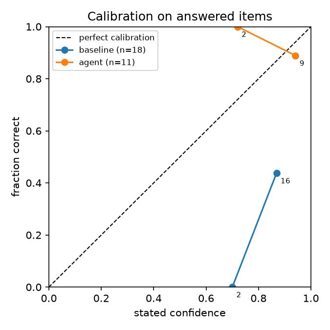

# Dev-set results (plumbing check, NOT the reportable test set)

- Model for BOTH systems: `qwen2.5:7b-instruct` (Ollama, CPU, temperature 0). 21 AI-drafted dev items: 3 cases, 4 unanswerables, 2 traps, 10 ADCdb fact claims (5 seen / 5 held-out).
- Dev items were written by the AI agent and are UNVERIFIED; real numbers come from the pharmacist-written `benchmark/test/` set.

| metric | baseline | agent (fair) | agent (leaky) |
|---|---|---|---|
| total points | -37.5 | 11.0 | 16.0 |
| accuracy (answered) | 0.389 | 0.909 | 0.938 |
| coverage | 0.947 | 0.579 | 0.842 |
| Brier (answered, lower=better) | 0.4192 | 0.0919 | 0.0636 |
| abstained on unanswerables | 0.0 | 0.75 | 0.75 |
| confident & wrong | 9 | 1 | 1 |
| missed must-flags | 7 | 0 | 0 |
| items with fake citations | 7 | 0 | 0 |

Leaky-vs-fair gap (agent): +5.0 points, coverage 0.579 -> 0.842. On the fair split the agent abstains on held-out ADCs instead of guessing.

Guardrail on cases: baseline cards blocked 4/6 (caught 3/3 with a missed must-flag, 1 false block); agent cards blocked 2/6, 0 with missed must-flags.

